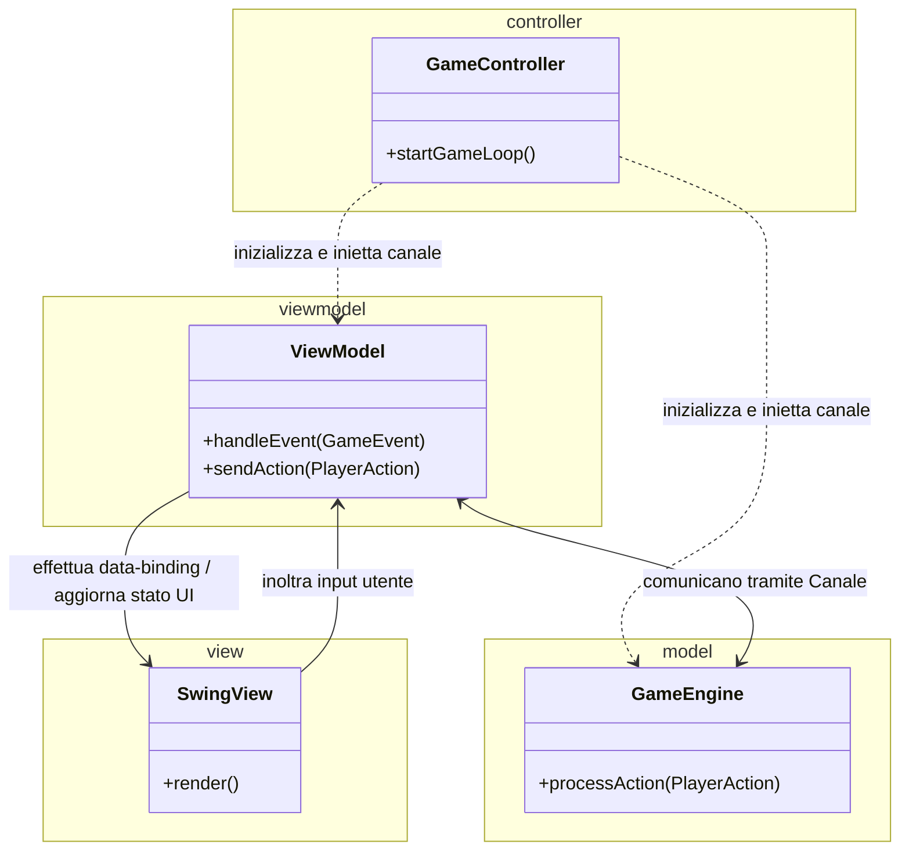
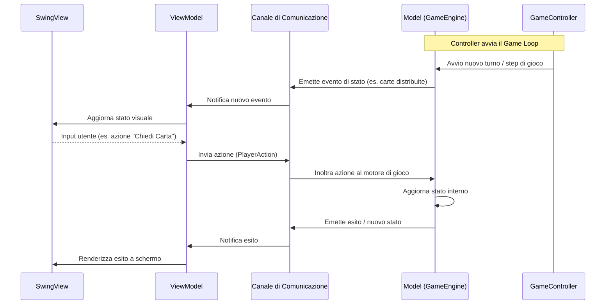

---
title: Design architetturale
nav_order: 3
parent: Report
---

# Design architetturale

Il pattern architetturale adottato si basa su una variante del modello **Model-View-ViewModel (MVVM)** orchestrata da un **Controller** centrale. L'architettura è stata progettata per garantire un disaccoppiamento netto tra la logica di dominio e l'interfaccia grafica (Swing), sfruttando un canale di comunicazione per lo scambio di messaggi, eventi e comandi.

A differenza di un approccio monolitico o guidato strettamente da chiamate bloccanti, in questa architettura il Controller ha una responsabilità focalizzata: inizializza le componenti, inietta gli estremi del canale di comunicazione tra il Model e il ViewModel, e gestisce il ciclo principale di esecuzione (Game Loop).

## Model

Il Model incapsula lo stato interno e le regole del gioco. Rimane completamente agnostico rispetto alla tecnologia grafica utilizzata.

- È progettato per essere autonomo e deterministico, ricevendo azioni dal canale ed elaborando le transizioni di stato;
- Al verificarsi di cambiamenti di stato (es. distribuzione delle carte, turni, calcolo punteggi), emette eventi sul canale destinati al livello di presentazione;
- È completamente isolato e verificabile in modo deterministico tramite test automatici unitari e di integrazione.

## ViewModel

Il ViewModel agisce da intermediario intelligente tra l'interfaccia grafica e il canale del motore di gioco:

- Riceve ed elabora gli eventi provenienti dal Model attraverso il canale, trasformandoli in uno stato facilmente consumabile e visualizzabile dall'interfaccia grafica;
- Espone proprietà e comandi per la View;
- Raccoglie le intenzioni e gli input dell'utente dalla View, traducendoli in messaggi/azioni formattati da inoltrare sul canale verso il Model.

## View

La View è sviluppata con Swing e si occupa esclusivamente della visualizzazione e del rendering grafico dei componenti a schermo.

- Osserva lo stato esposto dal ViewModel e aggiorna di conseguenza gli elementi dell'interfaccia grafica (pannelli, bottoni, carte, animazioni);
- Raccoglie i click e gli eventi generati dall'utente inoltrandoli direttamente al ViewModel, senza interagire mai con il Model o con il canale di gioco sottostante.

## Controller e Game Loop

Il GameController rappresenta il punto di coordinamento principale:

- **Bootstrap**: all'avvio crea le strutture del canale, istanzia il Model, il ViewModel e collega la View;
- **Game Loop**: governa il ciclo di vita della partita gestendo la sequenza dei round e l'avanzamento dei turni, assicurando che lo scambio dei messaggi sul canale avvenga in modo fluido e sincronizzato.

Il flusso di interazione tra i componenti tramite canale è illustrato nel seguente diagramma di sequenza:

