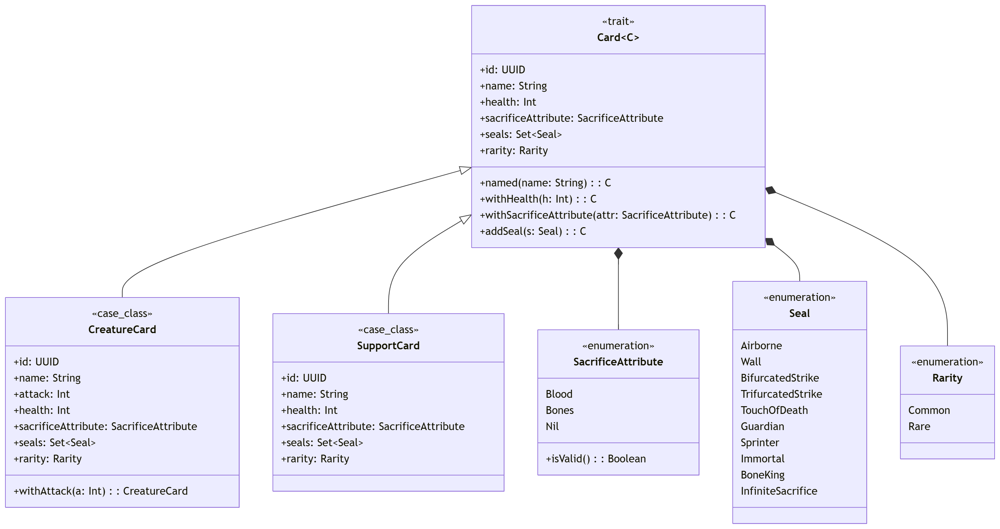

# Design delle Carte e dei Sigilli

Il sistema modella le carte da gioco attraverso un'astrazione fondamentale che definisce le proprietà condivise da tutte le entità giocabili, come la salute, il costo di evocazione e l'insieme dei Sigilli.

Da questa struttura di base derivano due specializzazioni principali:
*   `CreatureCard`: rappresenta una carta in grado di infliggere danni, possedendo un parametro aggiuntivo dedicato ai punti di attacco.
*   `SupportCard`: modella carte puramente difensive o strategiche, sprovviste del parametro di attacco (es. ostacoli come la carta "boulder").

Le abilità speciali e i modificatori di costo sono stati estratti dal corpo della carta in entità enumerative indipendenti.
Questa scelta è guidata dalla necessità di rendere il catalogo del gioco facilmente estensibile.
Mantenendo separata la struttura dati della carta dal comportamento specifico della sua abilità, il motore di gioco può elaborare le entità in modo polimorfico.
Per introdurre una nuova meccanica, infatti, è sufficiente espandere il dominio dei sigilli senza dover alterare le gerarchie delle classi esistenti.

Di seguito il diagramma delle classi che mostra come è stato strutturato il componente Card:

