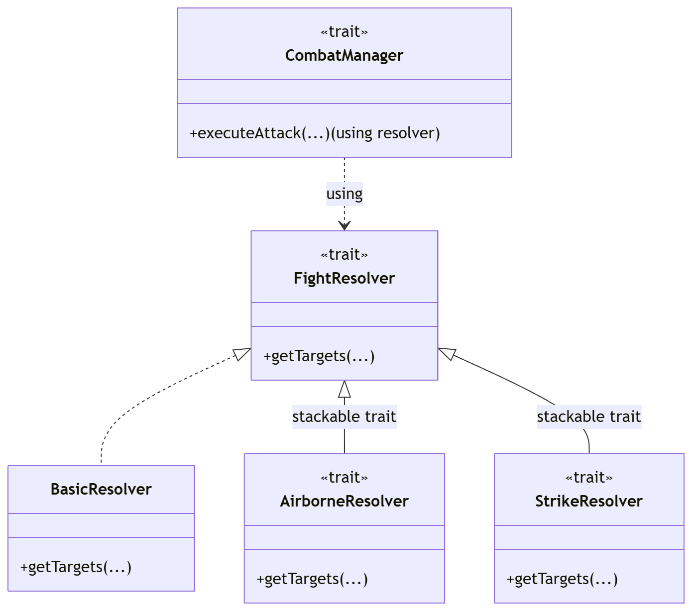

Relativamente all'implementazione del sistema, ho realizzato parti consistenti del core del sistema, cercando di
creare DSL per costruire in modo idiomatico certi componenti del sistema. Inoltre ho lavorato anche sulla parte
di gestione del combattimento del gioco, ottimizzando l'orchestrazione dei vari componenti che ne fanno parte. Ho anche
lavorato sulla parte di view relativa a questa sezione del flow di gioco. Seguono i file a cui ho contribuito totalmente
o parzialmente:
- Model: `Card`, `CardLibrary`, `Deck`, `DrawDecks`, `PlayerHand`, `BotStrategy`, `GameItem`;
- Managers: `CombatManager`, `FightResolver`, `MovementManager`, `SacrificeManager`, `SaveManager`;
- View: `BoardView`, `DecksView`, `FightView`, `HandView`, `StatsView`, `ViewModelFight`.

---

## Modello Dati Base: Carte e Attributi

Il cuore del dominio è rappresentato dalle carte da gioco. L'implementazione di queste entità sfrutta
funzionalità avanzate del type system di Scala 3 per garantire immutabilità e riuso del codice.

### F-Bounded Polymorphism in Card

L'entità base è definita tramite il `sealed trait Card[C <: Card[C]]`. L'utilizzo dell'F-Bounded Polymorphism
(il parametro di tipo ricorsivo `C`) è una scelta architetturale cruciale: permette ai metodi della superclasse
(come `withHealth` o `addSeal`) di restituire sempre l'esatto tipo concreto della sottoclasse che li invoca
(`CreatureCard` o `SupportCard`), senza richiedere cast espliciti a tempo di compilazione.
Per mantenere l'immutabilità senza duplicare la logica, il trait impone il metodo protetto `copyCard`,
che viene implementato dalle singole *case class* per fare da ponte verso il loro metodo nativo `copy`.

Di seguito un estratto che illustra questo pattern:

```scala
sealed trait Card[C <: Card[C]]:
  def id: UUID
  def health: Int
  
  infix def withHealth(health: Int): C =
    if health >= 0 then copyCard(health = health) else this.asInstanceOf[C]

  protected def copyCard(
      id: UUID = this.id,
      health: Int = this.health
  ): C
```

Le abilità speciali e i costi associati sono stati modellati anche sfruttando gli enum parametrici. Ad esempio,
SacrificeAttribute implementa casi parametrici come `Blood(value: Int)` e `Bones(value: Int)`,
garantendo un pattern matching sempre esaustivo e type-safe durante la validazione delle evocazioni.

## Deck e PlayerHand
Per modellare il mazzo e la mano del giocatore, si è scelto di utilizzare gli opaque type.

```scala
opaque type Deck = List[Card[?]]
opaque type PlayerHand = List[Card[?]]
```

Questa astrazione consente di trattare `Deck` e `PlayerHand` come tipi completamente distinti a compile time
(evitando errori semantici come il passaggio di una mano a una funzione che si aspetta un mazzo),
pur essendo a runtime delle semplici `List[Card[?]]`. Questo garantisce che non vi sia alcun overhead prestazionale
dovuto alla creazione di classi wrapper.

Tutte le operazioni logiche su queste collezioni sono fornite tramite metodi `extension`.
Le operazioni che mutano logicamente lo stato, come l'estrazione di una carta, sono state implementate
in modo puramente funzionale: il metodo `draw` del `Deck` utilizza il pattern matching sulle liste `(head :: tail)`
per restituire un `Option[(Card[?], Deck)]`, fornendo simultaneamente la carta pescata e la nuova istanza immutabile
del mazzo senza side effects.

## Bot e Oggetti
Oltre alle entità statiche, il dominio include componenti per gestire le interazioni dinamiche all'interno dello scontro.

### BotStrategy
Il comportamento dell'avversario è astratto dal trait `BotStrategy`, il quale espone il metodo `playTurn(fightState:
FightState): FightState`. L'implementazione `RandomBotStrategy` calcola le mosse valide esaminando la riga di preparazione
e seleziona posizioni casuali tramite `scala.util.Random`. L'aggiornamento della griglia avviene applicando una `foldLeft`
sulle posizioni selezionate, accumulando i cambiamenti in una nuova istanza immutabile della `Board`.

### GameItem
L'inventario consumabile è modellato dal trait `GameItem`, il cui contratto prevede il metodo `use(state: FightState, target: Option[BoardPosition]): FightState`.
Le implementazioni concrete (come `Scissors` o `SquirrelBottle`) definiscono l'effetto dell'oggetto applicando
trasformazioni. In particolare, `Scissors` utilizza il pattern matching (con guard per verificare
i limiti della board) per validare il target:

```scala
case Some(pos) if pos._1 == boardModel.IndexOfBotRow &&
  pos.isValid &&
  state.board(pos._1)(pos._2).isDefined =>
  val newBoard = state.board.updatedSlot(pos, boardModel.x)
```

In caso di successo, l'oggetto distrugge la carta nemica e si rimuove automaticamente dall'inventario ritornando un `FightState`
aggiornato, mantenendo così totale trasparenza referenziale.

## Risoluzione del Combattimento e Managers

Le logiche di gioco applicate alla board (combattimento, calcolo bersagli, sacrifici e movimenti)
sono state isolate all'interno di specifici moduli denominati *Manager*. Tutti i manager operano secondo
principi funzionali: non alterano lo stato globale, ma ricevono in input lo stato corrente e restituiscono strutture
dati immutabili contenenti i risultati dell'operazione.

#### FightResolver

Per determinare quali bersagli colpirà una carta in base ai suoi sigilli, è stato definito il trait `FightResolver`,
che espone il metodo `getTargets`. Invece di implementare una complessa gerarchia di classi per gestire ogni possibile
combinazione di abilità, si è scelto di usare il **Trait Stackable** pattern.

Le abilità che alterano il targeting, come l'attacco in volo o quello biforcato, sono state modellate come trait
che estendono `FightResolver` e usano la keyword `abstract override` sul metodo `getTargets`. In questo modo,
ogni trait può intercettare la chiamata, aggiungere la propria logica (ad esempio, calcolare gli slot adiacenti per
`Seal.BifurcatedStrike`) e delegare la continuazione della catena chiamando `super.getTargets`.

```scala
trait AirborneResolver extends FightResolver:
  abstract override def getTargets(attackerCol: Int, attacker: Card[?], opponentRow: BoardRow): List[HitTarget] =
    attacker.seals match
      case seals if !seals.contains(Seal.Airborne) =>
        super.getTargets(attackerCol, attacker, opponentRow)
// ...
```

### CombatManager
Il motore che orchestra la fase di attacco è il CombatManager. L'aspetto architetturale più rilevante è il modo in cui
questo manager ottiene il risolutore dei bersagli: attraverso l'uso dei Context Parameters.

```scala
def executeAttack(attackerCol: Int, attacker: Card[?], opponentRow: BoardRow)
                 (using resolver: FightResolver): CombatResult
```

Nel companion object del manager, viene definita un'istanza implicita given che compone i trait stackable
precedentemente descritti: 
`given defaultResolver: FightResolver = new BasicResolver with AirborneResolver with StrikeResolver`
In questo modo, l'istanza corretta viene iniettata automaticamente a compile time, mantenendo il codice
pulito e il coupling basso. I risultati dell'attacco vengono incapsulati e restituiti tramite le classi
immutabili `CombatResult` e `RowAttackResult`, che aggregano i danni inflitti, le ossa guadagnate dalle carte morte
e la riga aggiornata.

<div align="center">
  
</div>

### MovementManager e SacrificeManager
Le restanti meccaniche della board sono gestite da manager dedicati, implementati tramite computazioni
stateful basate su foldLeft:

*   `MovementManager`: Si occupa di calcolare gli spostamenti delle carte (per esempio il sigillo Sprinter o Guardian). 
    L'implementazione utilizza una `foldLeft` che accumula non solo la nuova BoardRow aggiornata, ma anche un `Set[UUID]`
    delle carte già mosse, garantendo che una stessa carta non venga processata due volte nello stesso turno se finisce
    in una colonna successiva.
*   `SacrificeManager`: Calcola le risorse ottenute dai sacrifici applicando i modificatori dei sigilli.
    Tramite pattern matching sui sigilli della carta sacrificata, il manager determina se restituire sangue extra
    (ad esempio WorthySacrifice), ossa extra (BoneKing) o se lasciare la carta intatta sulla board pur fornendo
    la risorsa (ManyLives), restituendo infine l'oggetto aggregato `SacrificeResult`.

### SaveManager
Come funzionalità aggiuntiva, è stato implementato un sistema di salvataggio dello stato di gioco.
Per disaccoppiare la logica di dominio dal formato di output (JSON tramite la libreria uPickle),
il `SaveManager` introduce dei Data Transfer Object, come CardDTO, NodeDTO etc. Lo stato della partita
(mazzo, inventario e mappa) viene mappato su questi DTO, scritto su file, e ricostruito parsando il file e
interrogando la `CardLibrary` per ripristinare le istanze corrette.

## Fight UI

Il rendering della fase di combattimento e la gestione degli input utente sono affidati a un'architettura basata
su Scala Swing. La complessità principale in questa sezione riguardava la gestione della concorrenza:
il motore di gioco risolve gli eventi in modo quasi istantaneo, mentre l'interfaccia grafica necessita di tempistiche
umane per riprodurre le animazioni in modo comprensibile.

### ViewModelFight

Il `ViewModelFight` funge da intermediario tra il `GameMessagesChannel` e l'Event Dispatch Thread (EDT) di Swing.
Per governare l'arrivo degli aggiornamenti, il ViewModel non aggiorna la GUI direttamente, ma implementa una
coda di eventi temporizzata basata su una `scala.collection.mutable.Queue`.

L'implementazione prevede che:
1.  Un `Future` in background resti in ascolto continuo dei messaggi in arrivo dal Model.
2.  Alla ricezione di un nuovo stato (FightState, TurnState), il trasferimento dell'evento verso la coda interna
    venga forzato sul thread grafico invocando `Swing.onEDT`, prevenendo così qualsiasi data race.
3.  Il metodo ricorsivo `processNextEvent()` estragga il prossimo stato e applichi dinamicamente un
    ritardo tramite l'istanziazione di un `javax.swing.Timer`. Se, ad esempio, lo stato corrisponde a un'azione
    dell'avversario (TurnState.botTurn o TurnState.botFight), il timer introduce una pausa di 2000 millisecondi
    prima di consumare l'evento successivo, migliorando la user experience del gameplay.

### FightView

L'interfaccia principale, `FightView`, estende un `BorderPanel` fungendo da aggregatore per componenti altamente
specializzati (`BoardView`, `HandView`, `DecksView`, `StatsView`). Oltre a curare il layout, la `FightView`
agisce da controllore di stato locale: sono corservate variabili transitorie come `selectedCard`, `selectedItem`
e la lista delle coordinate per i sacrifici `selectedSacrifices`.

Solo quando l'intento dell'utente è validato localmente (come verificare che il blood accumulato dai sacrifici
selezionati sia sufficiente per il costo della carta), la vista delega al ViewModel l'invio del messaggio definitivo
al Model.

Infine, la reattività ai comandi è stata realizzata registrando i listener nativi di Scala Swing
(`listenTo(mouse.clicks, mouse.moves)`) e destrutturando gli eventi tramite pattern matching all'interno dei blocchi
dichiarativi `reactions`.
